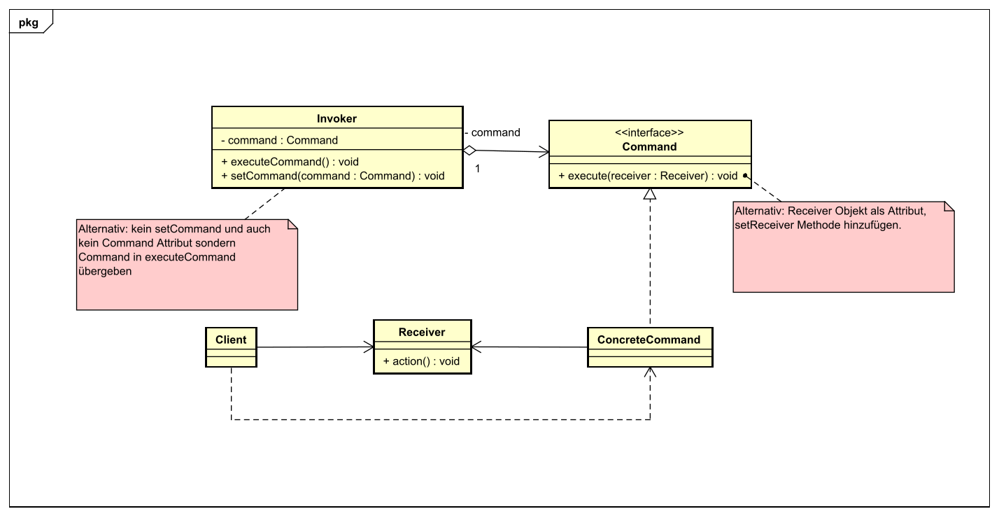
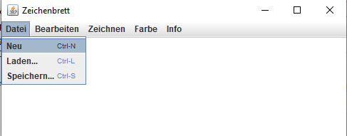
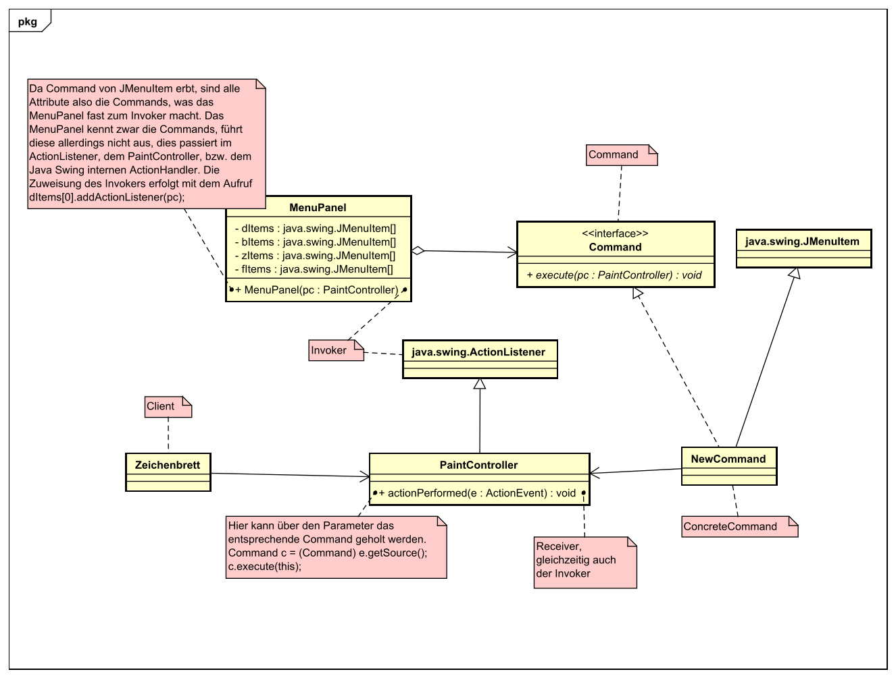

# Command Pattern
## Problem
Eine bestimmte Abfolge an Kommandos soll zu einem bestimmten Zeitpunkt
ausgeführt werden, ohne zu wissen, was die Operation bewirkt und welches
Kommando ausgeführt wird. Außerdem sollen in weiterer Folge Kommandos
rückgängig gemacht werden.

## Beschreibung
Im Command Pattern geht es genau um die Lösung dieses Problem. Dabei gibt es einen
Client, welcher die Commands kennt und dem Invoker mit der Information sendet.
Der Receiver ist dann im Grunde die Klasse, in der die Logik passend zum Output des Commands ausgeführt wird.


## Beispiel: Zeichenbrett für die Welt
Als Beispiel hier das [Zeichenbrett für die Welt](sew3-paint-LHalbritter-master/Paint_old/src/paintNew/PaintController.java), 
wo man Formen zeichnen kann und diese Speichern und Laden kann. Es wurde mit java swing gearbeitet
und somit alle Optionen zum Stiftfarbe ändern, speichern und laden von files über den ActionListener geregelt.

Das heißt die actionPerformed Methode wurde überschrieben und so sieht sie vor dem Command Pattern aus:

```java
@Override
public void actionPerformed(ActionEvent e) {
		/**
		 * Wenn der gedrückte Button "Stift" war, soll eine Auswahl erscheinen, die die
		 * Stiftfarbe ändert.
		 */
		if(e.getActionCommand().equals("Stift")){
			this.pc = JColorChooser.showDialog(null, "Stiftfarbe", null);
			pp.setPenColor(this.pc);
		}
		/**
		 * Wenn der gedrückte Button "Hintergrund" war, soll eine Auswahl erscheinen, die die
		 * Hintergrundfarbe ändert.
		 */
		if(e.getActionCommand().equals("Hintergrund")){
			this.bg = JColorChooser.showDialog(null, "Hintergrundfarbe", null);
			pp.setBgColor(this.bg);
			pp.z.setzeHintergrund(this.bg);
		}
		//*Debug* System.out.println(e.getActionCommand());
		//Bei "Speichern" soll der Speichervorgang begonnen werden.
		if(e.getActionCommand().equals("Speichern..."))this.speichern();
		//Bei "Laden" soll der Ladevorgang begonnen werden.
		if(e.getActionCommand().equals("Laden..."))this.laden();
		//Bei "Neu" soll das Zeichenbrett geleert werden.
		if(e.getActionCommand().equals("Neu")) {
			pp.z.reset();
			pp.setPenColor(Color.WHITE);
			pp.setBgColor(Color.WHITE);
			this.pc = Color.BLACK;
			this.bg = Color.WHITE;
		}

        // Und viele weitere if-Verzweigungen...
}
```
Ein Teil der actionPerformed Methode im [PaintController](sew3-paint-LHalbritter-master/Paint_old/src/paintNew/PaintController.java)

Die ActionCommands bekommt man vom [MenuPanel](sew3-paint-LHalbritter-master/Paint_old/src/paintNew/MenuPanel.java):

```java
// Menüleisten-Subelemente
private JMenuItem[] dItems, bItems, zItems, fItems;

public MenuPanel(PaintController pc){
        
		z = new Zeichenbrett();
        
        // Items für Dateimanipulation initialisieren
		dItems = new JMenuItem[3];

        // Untermenüelemente hinzufügen
        dItems[0] = new JMenuItem("Neu");
        //Shortcut setzen
        dItems[0].setAccelerator(KeyStroke.getKeyStroke(KeyEvent.VK_N, Toolkit.getDefaultToolkit().getMenuShortcutKeyMask()));
        
        dItems[1] = new JMenuItem("Laden...");
        dItems[1].setAccelerator(KeyStroke.getKeyStroke(KeyEvent.VK_L, Toolkit.getDefaultToolkit().getMenuShortcutKeyMask()));
        
        dItems[2] = new JMenuItem("Speichern...");
        dItems[2].setAccelerator(KeyStroke.getKeyStroke(KeyEvent.VK_S, Toolkit.getDefaultToolkit().getMenuShortcutKeyMask()));
        
        for(int i = 0; i < dItems.length; i++){
            // Jedes dItem dem Menüpunkt 'Datei' hinzufügen
            datei.add(dItems[i]);
            // ActionListener adden
            dItems[i].addActionListener(pc);
        }
}
```
Ein Teil des MenuPanel Konstruktors

Wie man sieht ist das ziemlich unpraktisch gelöst in der ```actionPerformed()``` Methode
und nicht sehr leicht erweiterbar, da man dann neue if-Verzweigungen hinzufügen muss. Zur Rettung
kommt das Command Pattern!

## Command Pattern im Beispiel
Das Command Pattern kann gut in Kombination mit den ```java.swing``` Elementen arbeiten. So kann zum Beispiel jedes
Command von der Klasse ```JMenuItem``` erben, welche einen Menüpunkt beschreibt. Um also zu erklären, wie man das Command
Pattern mithilfe der Menüpunkte nutzen kann, wird als Beispiel der "Neu" Menüpunkt genutzt, welcher das Zeichenbrett leert.


Der Code dazu lautet wie folgt (alte Lösung):
```java
if(e.getActionCommand().equals("Neu")) {
        pp.z.reset();
        pp.setPenColor(Color.WHITE);
        pp.setBgColor(Color.WHITE);
        this.pc = Color.BLACK;
        this.bg = Color.WHITE;
}
```

An dem Code in der if-Verzweigung ändert sich nicht viel, nur dass er in eine Extra-Klasse verschoben wird.
Die Klasse ist unter [sew3-paint-LHalbritter-master/Paint_new/src/paintNew/commands/NewCommand.java](sew3-paint-LHalbritter-master/Paint_new/src/paintNew/commands/NewCommand.java)
zu finden. Nun sieht der Code darin nach aktuellem Stand so ungefähr aus.

```java
import paintNew.PaintController;import javax.swing.*;
public class NewCommand extends JMenuItem{

    public NewCommand(String name){ super(name); }

    public void execute(PaintController pc){
        pc.getMenuPanel().z.reset();
        pc.getMenuPanel().setPenColor(Color.WHITE);
        pc.getMenuPanel().setBgColor(Color.WHITE);
        pc.setPenColor(Color.BLACK);
        pc.setBackgroundColor(Color.WHITE);
    }   

}
```
Aber dies wäre noch keine Vereinfachung des Codes in der ```actionPerformed``` Methode. Diese würde dann nämlich in etwa so aussehen:
```java
if(e.getActionCommand().equals("Neu")) {
    new NewCommand().execute(this);
}
```

Die Laufzeitpolymorphie hilft hierbei. Mit der Methode ```ActionEvent.getSource()``` bekommt man die Klasse,
in der das in der ````actionPerformed```` übergebene ````ActionEvent```` ursprünglich stattfand. Somit könnte man sich das ```NewCommand``` Objekt
also holen und die ```execute``` Methode aufrufen.
```java
NewCommand command = (NewCommand) e.getSource();
command.execute(this);
```
Da das ````NewCommand```` von ````JMenuItem```` (Normalerweise der Output von ```getSource()```) erbt
kann dieses leicht auf ```NewCommand``` geparsed werden. Damit dadurch aber auch das richtige Objekt zurückgegeben wird
muss in der MenuPanel Klasse die Initialisierung der Items verändert werden. Anstatt ```dItems[0] = new JMenuItem("Neu");```
ist es nötig diese Initialisierung zu ```dItems[0] = new NewCommand("Neu");``` zu ändern. Erst dann wirft obiger
Code keine Exceptions mehr.

Nun soll das Ganze auf weitere Commands erweitert werden. Um nicht das explizite Command angeben zu müssen,
ist es nötig ein ```Command``` Interface zu schreiben. Dieses ist für diesen Fall ziemlich simpel aufgebaut und
beinhaltet lediglich eine ```void execute(PaintController pc)``` Methode. Nun muss jedes neu erstellte Command dieses
Interface implementieren und gleichzeitig von einer Implementierung von ```JMenuItem``` erben, wenn das Command
über das Menü aufgerufen werden soll.

```java
import paintNew.PaintController;import paintNew.commands.Command;import javax.swing.*;
public class NewCommand extends JMenuItem implements Command {

    public NewCommand(String name){ super(name); }
    
    @Override
    public void execute(PaintController pc){
        pc.getMenuPanel().z.reset();
        pc.getMenuPanel().setPenColor(Color.WHITE);
        pc.getMenuPanel().setBgColor(Color.WHITE);
        pc.setPenColor(Color.BLACK);
        pc.setBackgroundColor(Color.WHITE);
    }   

}
```
_Neue NewCommand Klasse_

Sind alle Menüpunkte als Commands umgeschrieben und in ```MenuPanel``` so auch initialisiert sieht die
```actionPerformed``` Methode nach Einsatz des Command-Patterns so aus:
```java
public void actionPerformed(ActionEvent e) {
    Command command = (Command) e.getSource();
    command.execute(this);
}
```

Dies ist schon um einiges simpler als die vorherige Methode und auch viel effizienter zu erweitern, denn diese
Methode muss nie wieder angefasst werden. Es ist lediglich nötig eine neue Implementierung von ```Command``` zu schreiben
und diese auch in ```MenuPanel``` zu initialisieren. Die ```actionPerformed``` ist alle if-Verzweigungen los und
braucht auch keine neuen für neue Commands, da dies durch die Laufzeitpolymorphie geregelt wird.


# Zeichenbrett Benutzung
## Initialisierung
In einen der beiden Packages ```Paint_new/Paint_old``` den ```src``` Ordner als Sources Root markieren
(Rechts-Klick->Mark Directory As->Sources Root)

## Starten
Zum Starten die main-Methode im jeweiligen ```PaintController.java``` ausführen.